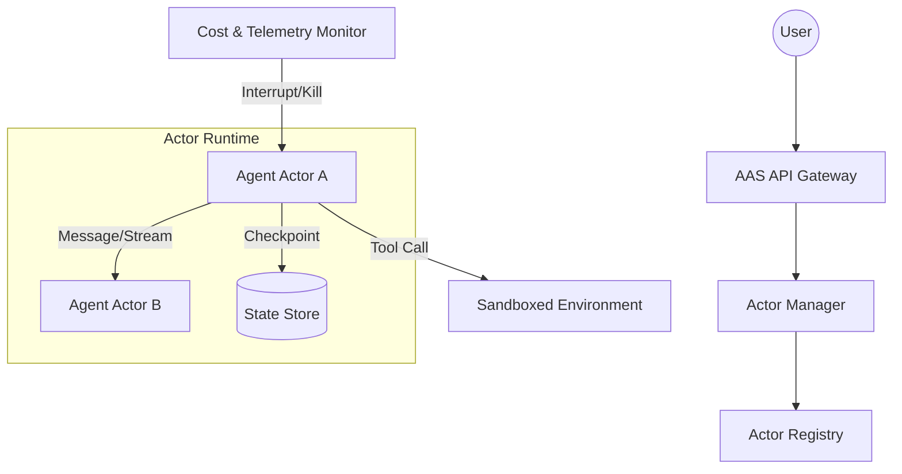

# Agent Actor System (AAS) Requirement Specification

## 1. Overview
The Agent Actor System (AAS) is a specialized runtime and framework designed to manage AI Agents as **Actors**. Unlike traditional Actor models (e.g., Akka, Erlang), AAS focuses on the high-latency, state-heavy, and cost-sensitive nature of LLM-driven interactions.

### Core Goals
- **Persistence First**: Every thought and state transition must be durable.
- **Interruption Native**: Support human intervention and real-time streaming control.
- **Cost Aware**: Prevent runaway loops through integrated token and latency budgeting.
- **Hierarchical Supervision**: Business-logic-aware failure recovery (e.g., "hallucination detection" vs "code error").

---

## 2. Core Concepts

### The Agent Actor
A self-contained unit of state and logic that:
- Maintains a long-term **Memory**.
- Communicates via **Asynchronous Streaming Messages**.
- Can be **Suspended** (waiting for a task/human) and **Resumed** (thawing the context).

### The Mailbox (Advanced)
Supports priority queues and **Transactional Messages** (a message is only removed from the queue if the Agent successfully commits its new state).

---

## 3. Functional Requirements

### 3.1 Lifecycle Management
- **Spawn**: Create a new Agent Actor with an initial prompt, personality, and toolset.
- **Snapshot/Checkpoint**: Periodically save the entire Actor state (history + local variables) to a persistent store.
- **Hibernation**: Serialize an idle Actor to disk/database, releasing all memory resources.
- **Deterministic Replay**: Ability to recreate an Actor's state by re-playing the message log.

### 3.2 Communication Protocol
- **Bidirectional Streaming**: Supporting `Stream<MessageBlock>` between Actors.
- **Partial Acknowledgement**: An Actor can acknowledge receipt of a *partial* stream to start processing.
- **Interrupts**: Explicit "Stop" or "Amend" signals that can reach an Actor even while it is in the middle of a "Thinking" (LLM generation) task.

### 3.3 Human-in-the-Loop (HITL)
- **AwaitHuman State**: A first-class state where an Actor yields execution and waits for an external "Human Approval" message.
- **Timeout Policies**: Define what happens if a human doesn't respond in time (Default action, Escalation, or Suspend).

### 3.4 Supervision & Fault Tolerance
- **Hierarchical Oversight**: Parent Actors can define how to handle specific sub-agent failures.
- **Failure Classifications**:
    - `Transient`: Network/Provider timeout (Automatic retry with backoff).
    - `Logic`: Tool input format error (Reflect and retry with corrected prompt).
    - `Critical`: Budget exceeded or Safety violation (Immediate shutdown and alert).

---

## 4. Operational Requirements (Management Console)

### 4.1 Cost & Resource Control
- **Token Budgeting**: Set hard limits on Prompt/Completion tokens per Actor instance.
- **Wall-clock Budgeting**: Prevent Agents from "spinning" for too long on a single problem.
- **Dead Letter Queue (DLQ)**: Failed or un-processable messages are routed to a human-readable queue for inspection.

### 4.2 Full-Stack Observability
- **Message Lineage**: Trace a task from the root Orchestrator down to the 4th level sub-agent.
- **Trace ID Propagation**: Automatic injection of Trace IDs into every tool call (SQL, Bash, API).
- **Time-Travel Debugging**: Step through the Agent's thought process message by message.

---

## 5. Technical Requirements

### 5.1 Architecture (Proposed)

### 5.2 Persistence Layer
- Support for **Event Sourcing**: Storing all incoming/outgoing messages as an immutable sequence.
- **Pluggable Vector Storage**: Each Actor can be configured with its own vector index for RAG.

### 5.3 Language Independence
- Core Runtime in **Rust** (High performance, Memory safety).
- Client SDKs in **Python** and **JavaScript** for ease of Agent development.

---

## 6. Target User Cases
1. **Autonomous DevOps Swarms**: Multiple agents collaborating on CI/CD pipelines.
2. **Customer Support Systems**: Handing off between specialized agents (Billing -> Technical -> Human).
3. **Long-running Research**: Agents that browse the web, summarize, and sleep until new data is available.
